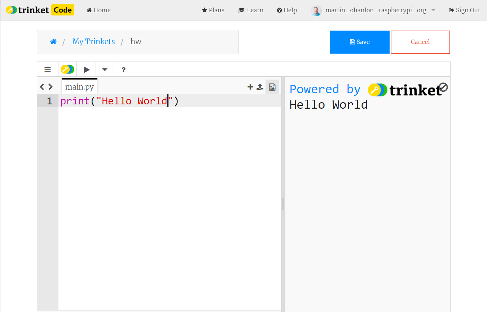
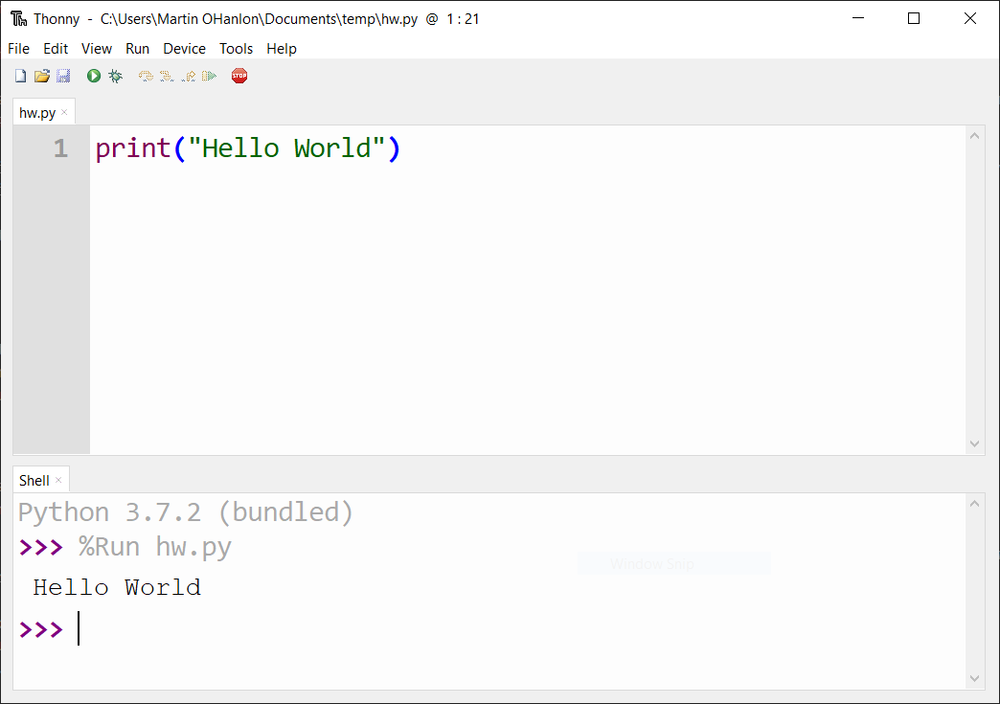
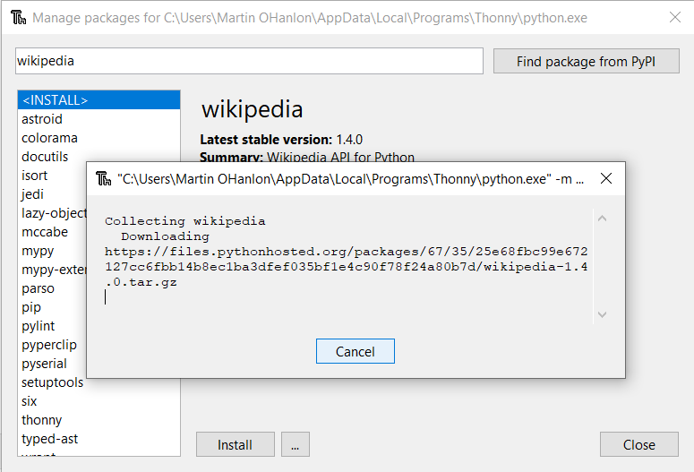
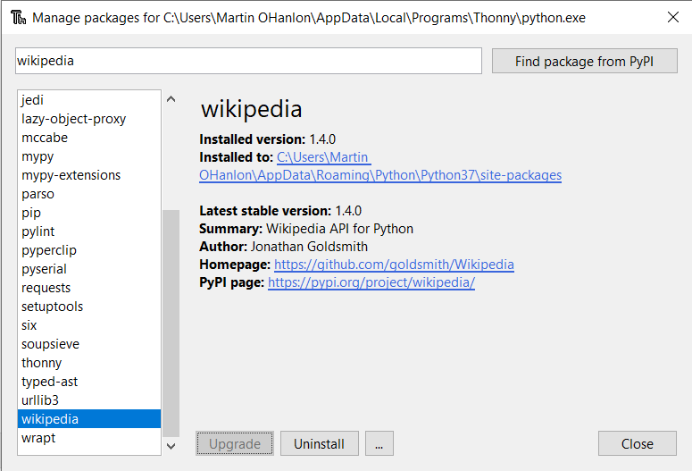
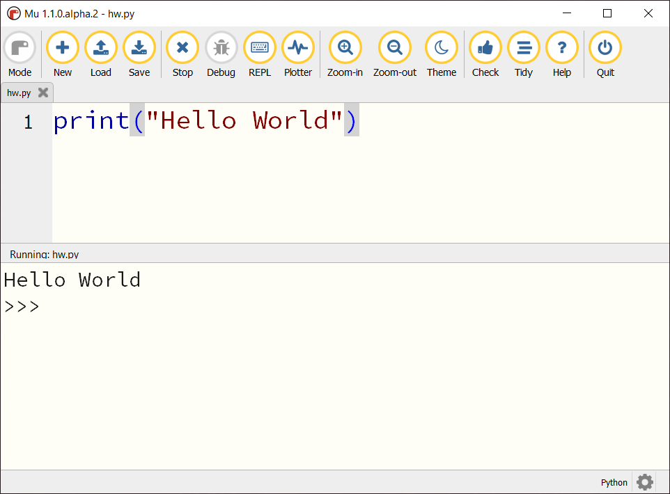

## Using your Python editors package installation tool

Online and dedicated editors usually come with "pre-installed packages" or have their own package installers which can be used to install additional packages.

You can find out more about online and dedicated editors in our [Python install options](https://projects.raspberrypi.org/en/projects/python-install-options) guidance.

Below is guidance regarding some of the popular online and installed Python editors. If your editor is not listed, be sure to check out their documentation.

### trinket.io

[trinket.io comes with some python modules pre-installed](https://trinket.io/docs/python) which you can use without having to install them yourself. 

There is no option to install additional packages if the module you wish to use is not available.

### repl.it

The [repl.it](https://repl.it) Packages feature can be used to add additional modules to your project. Due to the limitations of all online editors not all modules will work, however many will.

--- collapse ---

---
title: Install packages with repl.it
---

+ Open your program in repl.it.

+ Select the packages icon from the menu.

+ Search for the name of the package e.g. `wikipedia` and click on the name of the package you wish to install.

+ Click the **+** icon to download install the package.

+ Installation progress will be shown in the terminal.

+ Installation is complete when the **+** icon stops spinning and is replaced by a **-**.

**Note** - if you want to use a package in multiple programs, you will need to install it in each program.

--- /collapse ---

### Thonny

[Thonny](https://thonny.org) includes a Package Manager which can be used to install packages from [PyPI](https://pypi.org). The majority of modules should be supported. 

--- collapse ---

---
title: Install packages with Thonny
---

**Note** - if you are using Thonny in *simple mode* you will need to click ***switch to regular mode*** amd restart Thonny to install packages. 

+ Select **Manage Packages** from **tools** menu.

+ Enter the name of the package you want to install (e.g. wikipedia) and click **Find package from PyPI**.

+ Click **Install** to install the package.

+ The package will be downloaded and installed. A pop-up window will show the installation progress.
 

+ When the package has been installed the pop-up window will close and you will have the option to uninstall the package.

--- /collapse ---

### Mu

The current release of [Mu](https://codewith.mu) contains a "pre-installed" set of common modules. You cannot install any additional packages. 

The [alpha release of Mu](https://codewith.mu/en/download) includes a tool for installing "Third Party Packages" from [PyPI](https://pypi.org). The majority of modules should be supported. 

--- collapse ---

---
title: Installing packages with Mu Alpha
---

+ Click on the Mu Administration **cog** in the bottom right.

+ Select the **Third Party Packages** tab.

+ Enter the name of the package you wish to install e.g. `wikipedia` and click **OK**.

+ The package will be collected (downloaded) and installed.  

Multiple packages can be installed by placing the name of individual packages on new lines. Packages can be un-installed by removing the package name from the list and clicking **OK**.

--- /collapse ---